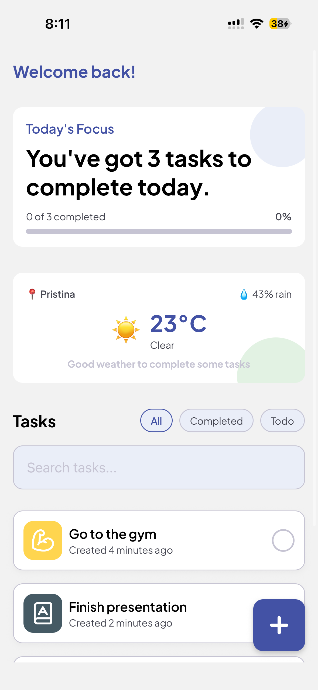
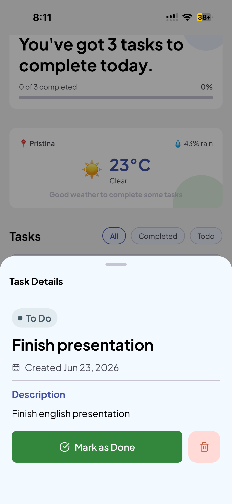
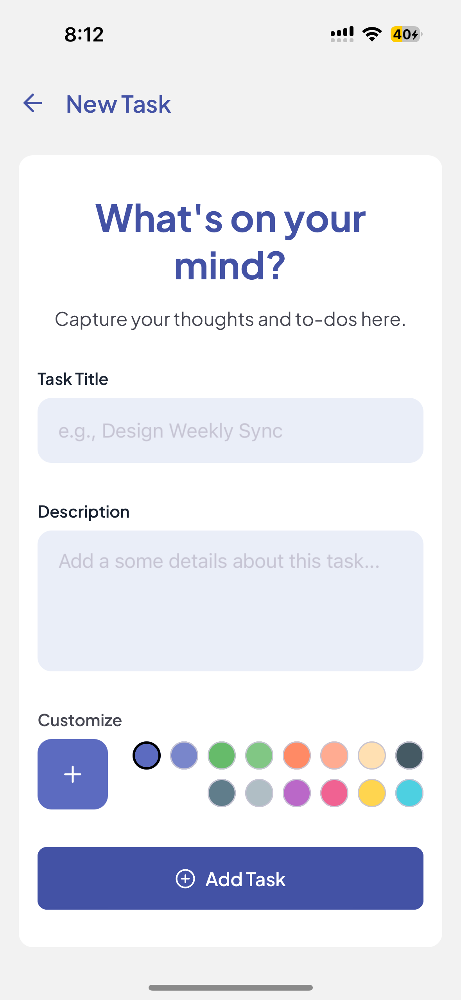
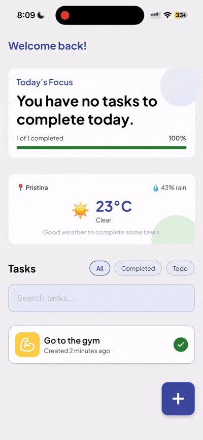

# 📝 Todo App

A simple and modern Todo application built with **React Native (Expo)**. This app helps you manage tasks efficiently with a clean UI and smooth performance.

---

## 🚀 Features

- Create, edit, and delete tasks
- Mark tasks as completed
- Persistent local storage
- Clean and responsive UI
- Works on Android, iOS, and Web (via Expo)

---

## 📸 Preview

### Home Screen



### Task Details


### Add Task


### App Demo


---

## 📦 Tech Stack

- React Native (Expo)
- TypeScript
- AsyncStorage

---

## 🛠️ Setup Instructions

### 1. Clone the repository

```bash
git clone https://github.com/alitinart/todo-expo-app.git
cd todo-expo-app
```

### 2. Install dependencies via your package manager

```bash
npm install
# or
yarn install
# or
pnpm install
```

### 3. Start the development server

```bash
npx expo start
```

---

## 📱 Run on your device

### Expo Go (recommended)

- Install Expo Go:
  - Android: https://play.google.com/store/apps/details?id=host.exp.exponent
  - iOS: https://apps.apple.com/app/expo-go/id982107779  
- Scan QR code after running:
  ```bash
  npx expo start
  ```

### Android Emulator

- Install Android Studio
- Start emulator
- Press `a` in terminal

### iOS Simulator (Mac only)

- Install Xcode
- Press `i` in terminal
